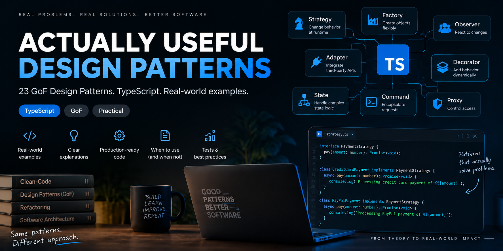

# Actually Useful Design Patterns



> The 23 GoF Design Patterns implemented in TypeScript with examples
> you might actually encounter in real-world applications.

Design patterns are usually taught with shapes, animals, pizzas, and other examples you will probably never write in production.

This repository takes a different approach.

Every pattern starts with a real software engineering problem and shows how the pattern can help solve it.

## What This Repo Is

Actually Useful Design Patterns is a TypeScript learning project inspired by the design-pattern diagrams and explanations in `Design-Patterns.pdf`.

The goal is not to prove that every pattern should be used everywhere. The goal is to show:

- What problem each pattern is trying to solve.
- What the naive solution tends to look like.
- How the pattern changes the design.
- When the pattern is useful.
- When the pattern is unnecessary or harmful.
- What trade-offs you accept when using it.

## Pattern Map

| Pattern | Practical example |
| --- | --- |
| Factory Method | Notification providers |
| Abstract Factory | Cloud infrastructure providers |
| Builder | HTTP request builder |
| Prototype | Document and template cloning |
| Singleton | Application configuration |
| Adapter | Payment gateway integration |
| Bridge | Notifications and delivery channels |
| Composite | File and folder permissions |
| Decorator | HTTP client middleware |
| Facade | Checkout system |
| Flyweight | Large product catalog |
| Proxy | API rate limiting |
| Chain of Responsibility | HTTP middleware pipeline |
| Command | Job and task queue |
| Interpreter | Search and filter query language |
| Iterator | Paginated API iterator |
| Mediator | Checkout form orchestration |
| Memento | Draft version history |
| Observer | Order events |
| State | Order lifecycle |
| Strategy | Pricing and discount strategies |
| Template Method | Data import pipeline |
| Visitor | Document AST processing |

## Pattern README Structure

Each pattern README should answer these questions:

1. Problem
2. Naive solution
3. Pattern
4. Structure diagram
5. TypeScript implementation
6. When it is useful
7. When not to use it
8. Trade-offs

## Quick Start

```bash
npm install
npm run demo:strategy
```

Patterns are intentionally executed one at a time so each example can be read and explored in isolation.

## Run One Demo

Use a dedicated npm script:

```bash
npm run demo:observer
npm run demo:abstract-factory
```

Or pass the pattern name to the generic runner:

```bash
npm run demo -- observer
npm run demo -- factory-method
```

## Project Structure

```text
src/
  scripts/
    runDemo.ts
  patterns/
    creational/
      <pattern-name>/
        index.ts
        README.md
    structural/
      <pattern-name>/
        index.ts
        README.md
    behavioral/
      <pattern-name>/
        index.ts
        README.md
```

Every pattern folder contains:

- `index.ts`: executable TypeScript demo.
- `README.md`: problem, naive solution, Mermaid UML diagram, implementation notes, appropriate uses, misuse cases, and trade-offs.
