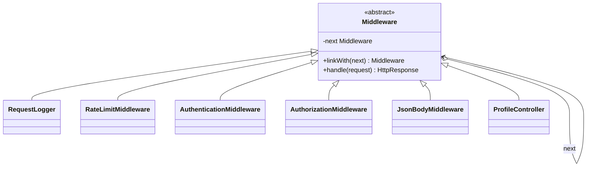

# Chain of Responsibility

> Practical example: HTTP Middleware Pipeline

## Problem

Requests pass through logging, authentication, content validation, and routing. Any step may return a response immediately.

## Naive Solution

Build one large request function with nested conditions for every cross-cutting concern.

## Pattern

Chain of Responsibility separates the part that changes behind a focused object contract. The client works with that abstraction instead of coordinating concrete implementations directly.

## Structure



## TypeScript Implementation

Each `Middleware` handles one concern and delegates with `super.handle()`. `linkWith()` assembles the pipeline and short-circuits on errors.

Run it with:

```bash
npm run demo -- chain-of-responsibility
```

## When It Is Useful

Processing consists of ordered, replaceable steps where a handler may stop propagation.

## When Not To Use It

Every request must follow one short fixed procedure whose control flow is clearer inline.

## Trade-Offs

Middleware stays focused and reusable, but ordering dependencies and hidden short-circuits require tests.
