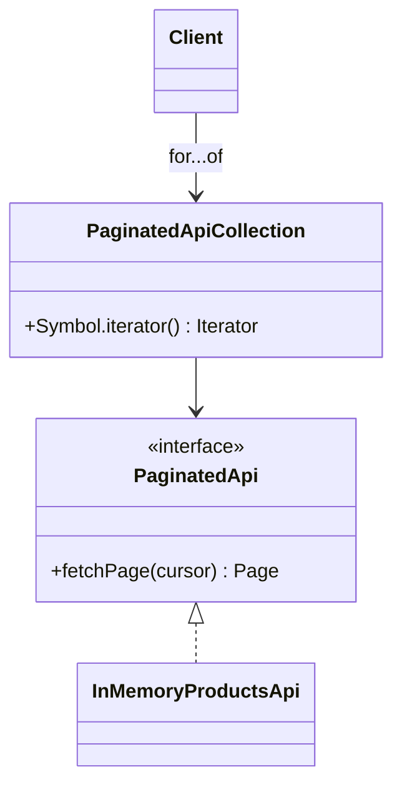

# Iterator

> Practical example: Paginated API Results

## Problem

Consumers want to process all products without manually managing cursors and page boundaries.

## Naive Solution

Repeat a fetch-loop with cursor state in every consumer.

## Pattern

Iterator separates the part that changes behind a focused object contract. The client works with that abstraction instead of coordinating concrete implementations directly.

## Structure



## TypeScript Implementation

`PaginatedApiCollection` implements `Iterable<T>` and its generator fetches pages lazily while exposing individual items.

Run it with:

```bash
npm run demo -- iterator
```

## When It Is Useful

Traversal mechanics are non-trivial and clients should see a normal sequence.

## When Not To Use It

Callers need page metadata, parallel requests, or explicit pagination controls.

## Trade-Offs

Consumers become simple and pages load lazily, but iteration can hide network cost and failures.
