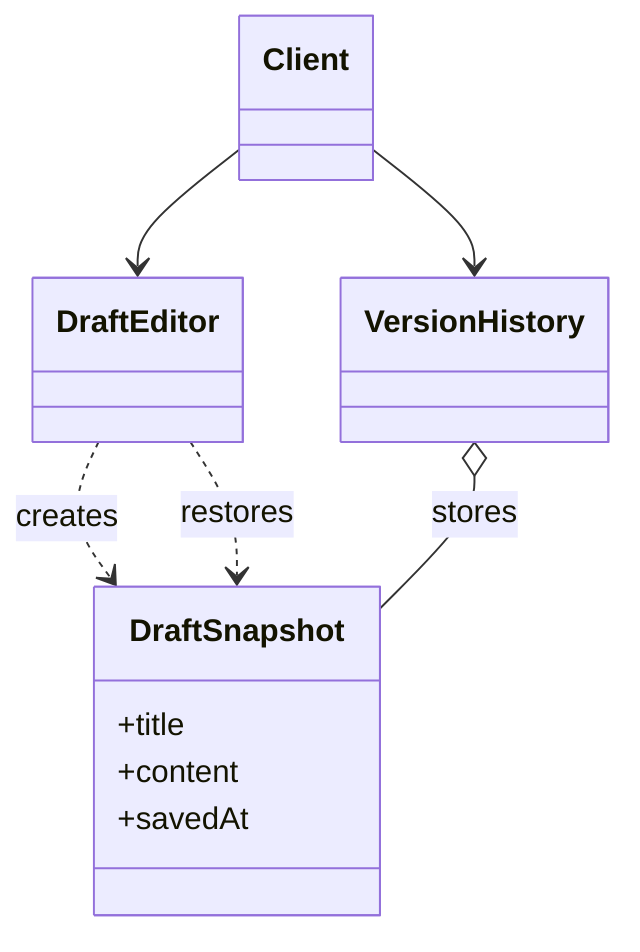

# Memento

> Practical example: Draft Version History

## Problem

A content editor must save and restore versions without exposing how its internal draft state is represented.

## Naive Solution

Let the history service reach into editor fields or manually copy partial state.

## Pattern

Memento separates the part that changes behind a focused object contract. The client works with that abstraction instead of coordinating concrete implementations directly.

## Structure



## TypeScript Implementation

`DraftEditor.save()` creates an immutable `DraftSnapshot`; `VersionHistory` stores snapshots and the editor restores a selected one.

Run it with:

```bash
npm run demo -- memento
```

## When It Is Useful

Users need undo, checkpoints, drafts, or version restoration of encapsulated state.

## When Not To Use It

State is huge, changes very frequently, or domain events/diffs are a better persistence model.

## Trade-Offs

Restoration is straightforward and encapsulated, but full snapshots consume memory and may hold sensitive data.
