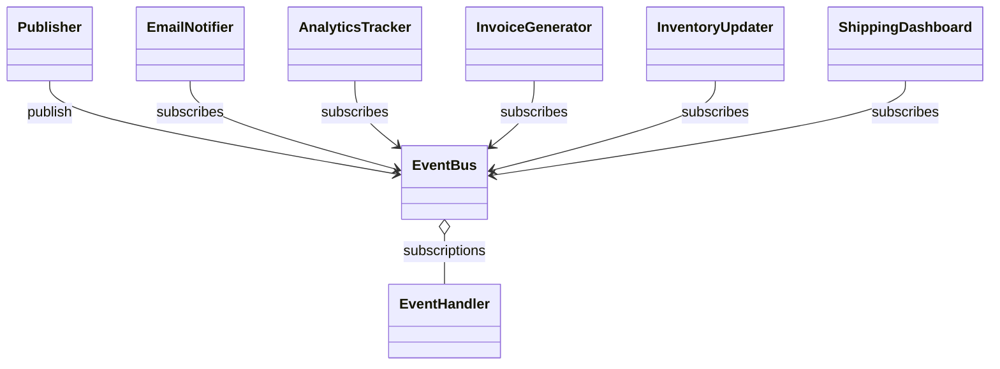

# Observer

> Practical example: Order Events

## Problem

After an order event, email, analytics, shipping, and future modules need to react without the order service importing them all.

## Naive Solution

Call every downstream service directly from the order workflow and edit it whenever a reaction is added.

## Pattern

Observer separates the part that changes behind a focused object contract. The client works with that abstraction instead of coordinating concrete implementations directly.

## Structure



## TypeScript Implementation

`EventBus` stores typed subscribers by event type, publishes domain events, supports unsubscribe, and isolates subscriber failures.

Run it with:

```bash
npm run demo -- observer
```

## When It Is Useful

One event has multiple independent reactions or extension points change frequently.

## When Not To Use It

The reactions form one transaction and must succeed or roll back together.

## Trade-Offs

Publishers and subscribers evolve independently, but event order, failure handling, and subscription cleanup need explicit policy.
