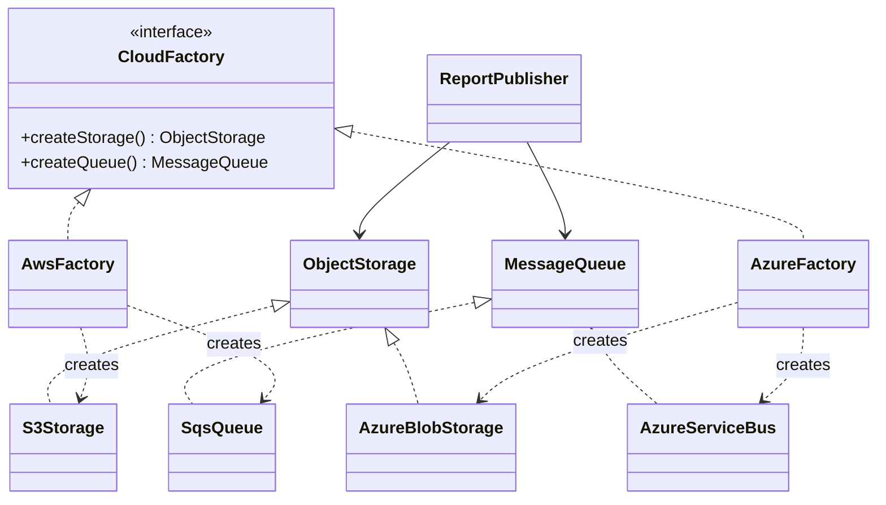

# Abstract Factory

> Practical example: Cloud Infrastructure Families

## Problem

A SaaS product can run on AWS or Azure. Storage and queue clients must always come from the same provider family.

## Naive Solution

Select storage and queues independently with conditionals. This can accidentally mix AWS and Azure services and spreads vendor decisions through the app.

## Pattern

Abstract Factory separates the part that changes behind a focused object contract. The client works with that abstraction instead of coordinating concrete implementations directly.

## Structure



## TypeScript Implementation

`CloudFactory` creates compatible `ObjectStorage` and `MessageQueue` products. `ReportPublisher` only consumes those contracts.

Run it with:

```bash
npm run demo -- abstract-factory
```

## When It Is Useful

Several related dependencies must switch together by environment, tenant, or deployment target.

## When Not To Use It

Only one dependency varies, or normal dependency injection already assembles a small object graph clearly.

## Trade-Offs

Provider families remain consistent, at the cost of an interface and implementation for every product family member.
