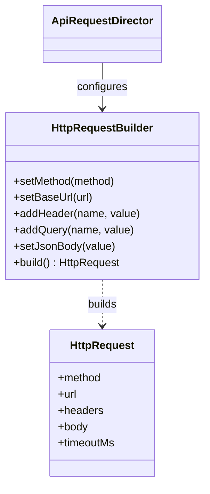

# Builder

> Practical example: HTTP Request Builder

## Problem

HTTP requests accumulate optional headers, authentication, query parameters, bodies, timeouts, and validation rules.

## Naive Solution

Use a long constructor or repeatedly assemble loose object literals whose valid combinations are unclear.

## Pattern

Builder separates the part that changes behind a focused object contract. The client works with that abstraction instead of coordinating concrete implementations directly.

## Structure



## TypeScript Implementation

`HttpRequestBuilder` exposes fluent construction steps and returns an immutable `HttpRequest`. `ApiRequestDirector` captures a reusable authenticated request recipe.

Run it with:

```bash
npm run demo -- builder
```

## When It Is Useful

Objects have many optional parts, invalid combinations, or repeated construction recipes.

## When Not To Use It

The object has few fields and an object literal is already obvious.

## Trade-Offs

Call sites become readable and validation is centralized, but the builder duplicates part of the product API.
