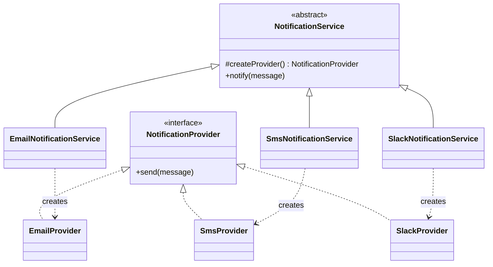

# Factory Method

> Practical example: Notification Providers

## Problem

A notification service started with email. SMS, push, and Slack then introduced provider-specific constructors and branching in every caller.

## Naive Solution

Keep a `switch` that instantiates an SDK client for each channel inside the notification workflow. Every new provider changes stable business code.

## Pattern

Factory Method separates the part that changes behind a focused object contract. The client works with that abstraction instead of coordinating concrete implementations directly.

## Structure



## TypeScript Implementation

`NotificationService` owns validation and the delivery workflow. Its factory method creates a `NotificationProvider`; subclasses choose Email, SMS, or Slack.

Run it with:

```bash
npm run demo -- factory-method
```

## When It Is Useful

Product creation varies while the workflow stays stable, or a framework expects subclasses to provide a dependency.

## When Not To Use It

A configuration map or one injected provider is enough and subclasses add no useful behavior.

## Trade-Offs

New providers do not modify the workflow, but each variant adds a provider and creator class.
