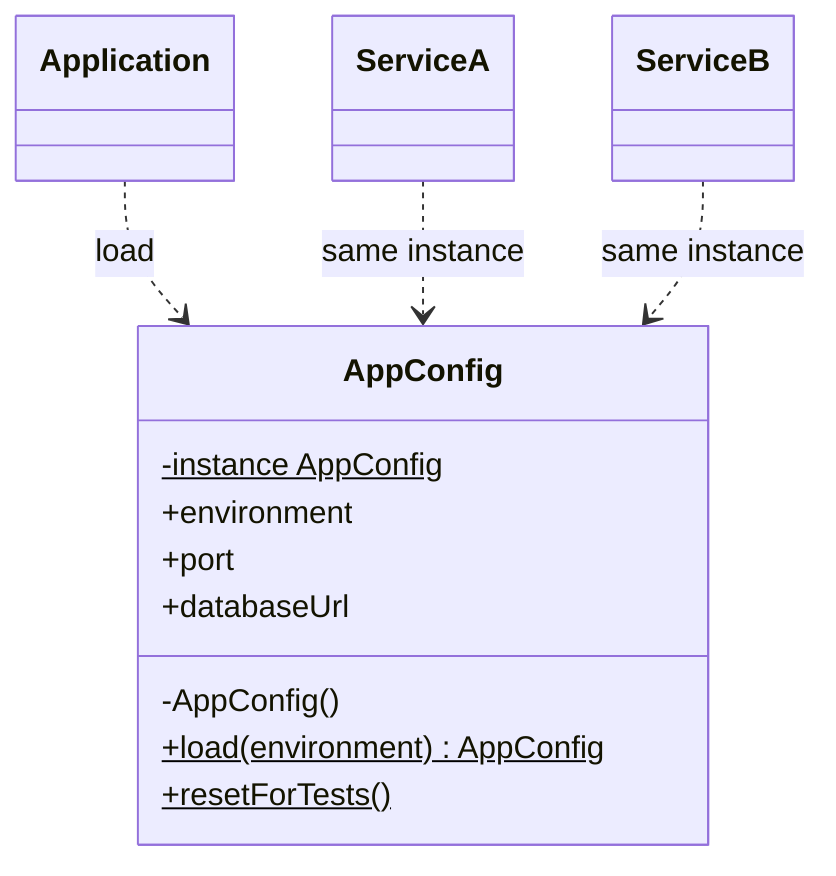

# Singleton

> Practical example: Application Configuration

## Problem

Configuration should be parsed and validated once, then shared consistently across application services.

## Naive Solution

Read `process.env` in every module, repeat parsing, and allow different defaults in different places.

## Pattern

Singleton separates the part that changes behind a focused object contract. The client works with that abstraction instead of coordinating concrete implementations directly.

## Structure



## TypeScript Implementation

`AppConfig.load()` creates one validated instance. Subsequent callers receive the same object; `resetForTests()` keeps tests isolated.

Run it with:

```bash
npm run demo -- singleton
```

## When It Is Useful

Exactly one process-wide instance is an invariant, such as boot-time configuration.

## When Not To Use It

The value should vary by request or test, or dependency injection can own its lifetime more transparently.

## Trade-Offs

Access is convenient and consistent, but global lifetime can hide dependencies and complicate test isolation.
