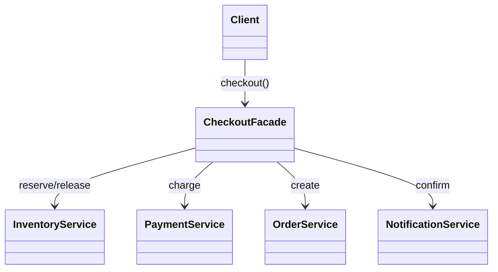

# Facade

> Practical example: Checkout Service

## Problem

Checkout coordinates inventory, payment, order persistence, and notification, including releasing stock after a failed payment.

## Naive Solution

Make controllers and consumers call every subsystem in the right order and reproduce compensation logic.

## Pattern

Facade separates the part that changes behind a focused object contract. The client works with that abstraction instead of coordinating concrete implementations directly.

## Structure



## TypeScript Implementation

`CheckoutFacade.checkout()` presents one use-case API and orchestrates the subsystem services behind it.

Run it with:

```bash
npm run demo -- facade
```

## When It Is Useful

A recurring workflow spans several subsystems and needs a stable transactional boundary.

## When Not To Use It

The facade only renames one call or is becoming an unrelated collection of application behavior.

## Trade-Offs

Consumers get a simple API and consistent orchestration, but the facade must stay focused to avoid becoming a god object.
