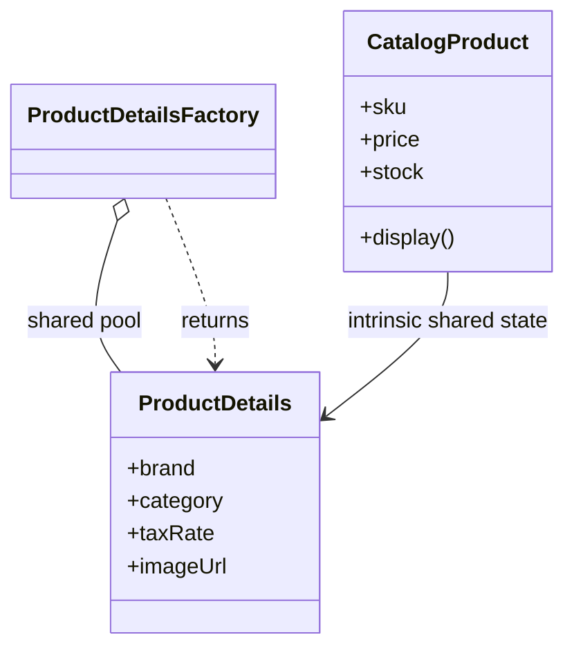

# Flyweight

> Practical example: Large Product Catalog

## Problem

A catalog may contain millions of SKUs that repeat brand, category, tax, and image metadata.

## Naive Solution

Store identical metadata objects on every product, multiplying memory use.

## Pattern

Flyweight separates the part that changes behind a focused object contract. The client works with that abstraction instead of coordinating concrete implementations directly.

## Structure



## TypeScript Implementation

`ProductDetailsFactory` interns immutable intrinsic data. Each `CatalogProduct` keeps only unique extrinsic state such as SKU, price, and stock.

Run it with:

```bash
npm run demo -- flyweight
```

## When It Is Useful

Many objects repeat sizeable immutable data and memory pressure is measurable.

## When Not To Use It

Objects are few, shared data mutates, or lookup overhead exceeds the memory benefit.

## Trade-Offs

Memory usage falls dramatically, but shared state must remain immutable and factory keys must be correct.
